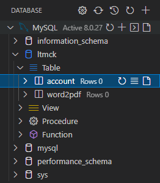

## WORD2PDF - How to deploy

1. Create a database project in MySQL and named it "ltmck".


2. Use "ltmck", execute query in [table.sql](table.sql) to create two tables and a admin account (you need to edit this file if you want to create new and multi user):
   - Account: Store account information.
   - Word2PDF: Store conversion progress.

After execute query file, it will look like this:



3. Edit web app config. [View in README.md](README.md#Config)

Ex. Below is my config:
```java
public static String dbUrl = "jdbc:mysql://localhost:3306/ltmck";
public static String dbUser = "root";
public static String dbPass = "cloney1301";
public static String dirTemp = "D:\\Documents\\ltmck";
```

4. Compile it using MVN: ```mvn clean package```. If this is done successfully, in directory you will found:
   - WAR file:
     > ```target/ltmcuoiky.war```
   - JSP directory:
     > ```target/ltmcuoiky```


5. Use file and folder in step 4, deploy to tomcat servers

Ex: My tomcat folder is ```D:\Programs\0.Programming\apache-tomcat-9.0.54-windows-x64\``` and set up server port is ```8080```:

   - Copy to tomcat server -> webapps folder (ex. ```D:\Programs\0.Programming\apache-tomcat-9.0.54-windows-x64\webapps```)
     
   - Start tomcat server:
     > ```D:\Programs\0.Programming\apache-tomcat-9.0.54-windows-x64\bin\startup.bat```.
     - Make sure you config tomcat server right before start.
     - After start, this will display a console for tomcat server. You can check System.out.println() if exist.
     

You are done for deployment. Enjoy!
