## WORD2PDF - How to deploy - With Eclipse

### 1. Set up database

1.1. Create a database project in MySQL and named it "ltmck".

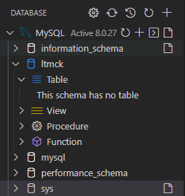

1.2. Use "ltmck", execute query in [table.sql](table.sql) to create two tables and a admin account (you need to edit this file if you want to create new and multi user):
   - Account: Store account information.
   - Word2PDF: Store conversion progress.

After execute query file, it will look like this:

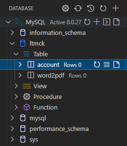

### 2. Set up project using Eclipse

2.1. Download project as zip

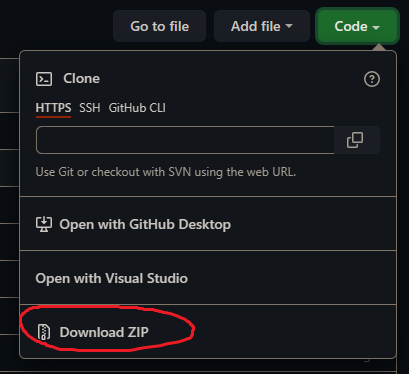

2.2. Open Eclipse, Click ```File``` -> ```Open Projects from File System...```

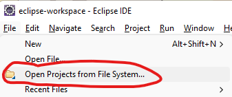

2.3. Next to Import source, click ```Archive...``` and locate to zip file you downloaded from step 2.1.

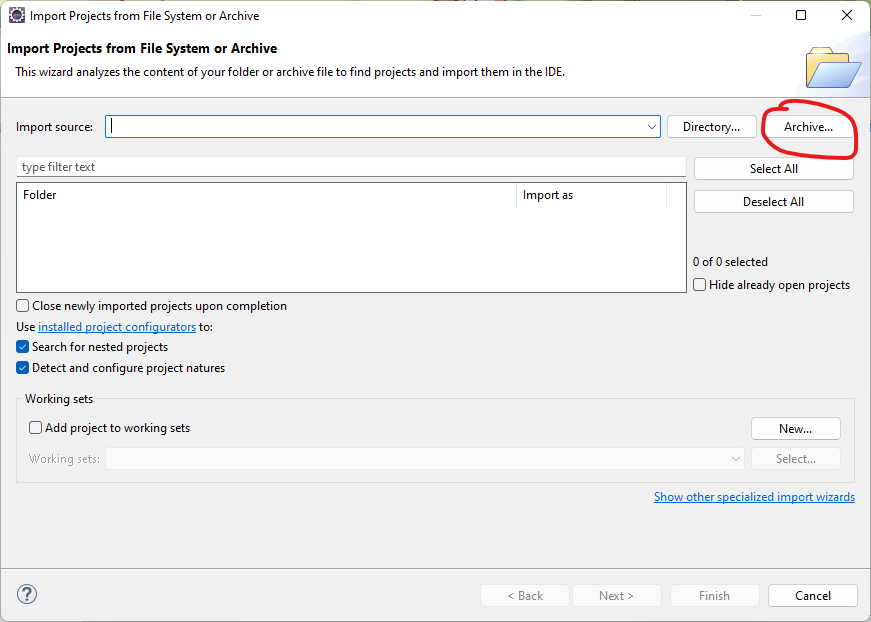

2.4. Check folder with tag as "Eclipse project". Uncheck another folders. Click ```Finish``` to continue.

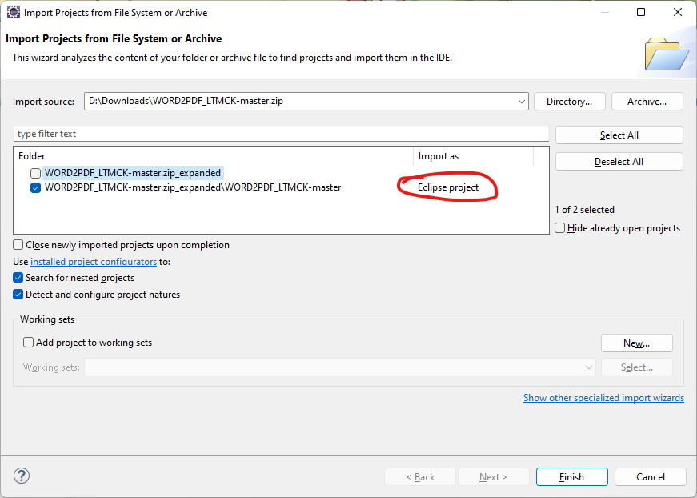

2.5. To ensure successful import, right-click to project, then choose ```Maven``` -> ```Update Project...``` You can quickly press ```Alt + F5```.

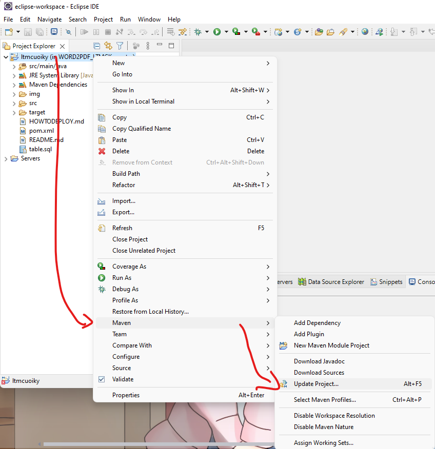

2.6. This dialog will shown, just click ```OK``` to continue.

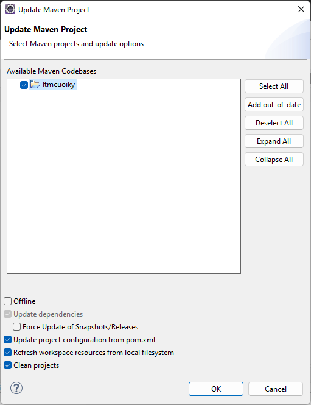

2.7. Config project. [View in README.md](README.md#Config)

### 3. Create tomcat server (if you don't have exist)

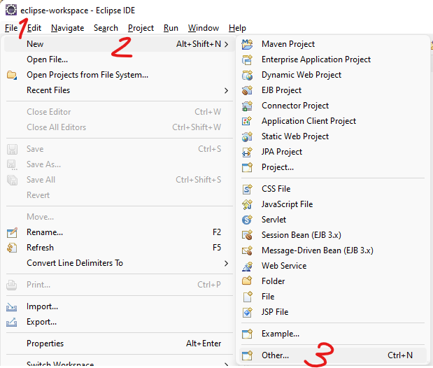

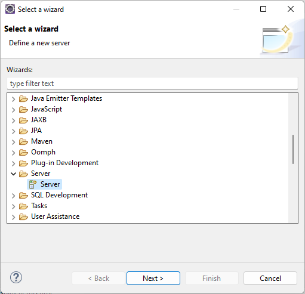

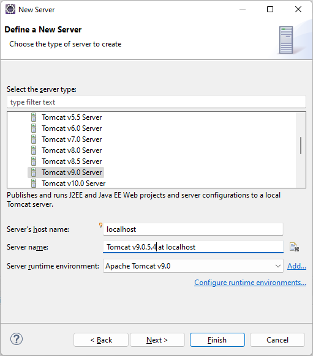

Click ```Add All >>``` to config all project for server, then click ```Finish```.

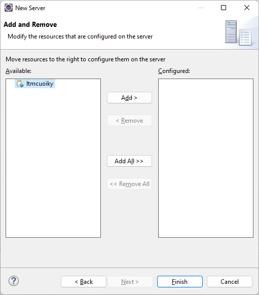

### 4. Run this web app

4.1. Once done, navigate to file ```src``` -> ```main``` -> ```webapp``` -> ```login.jsp```. Right-click this file and choose ```Run as``` -> ```Run on Server```.

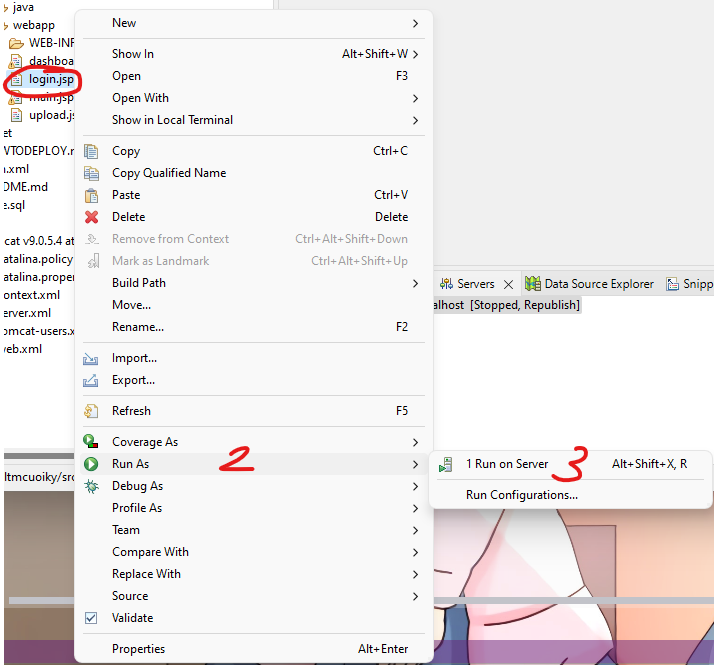

4.2. Click server you created on step 3 and click ```Finish```.

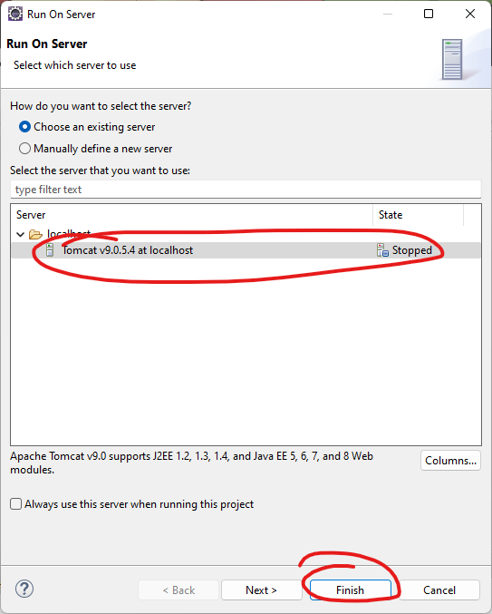

